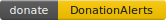

# Внимание! 
Данный проект ещё не окончен. Находится на стадии Beta-тестирования. В процессе использования возможны критические ошибки, которые в дальнейшем будут исправляться.


<a href="https://t.me/+j8Ohh3v0FZ8zNTgy">
   Группа Telegram
</a>


# SynologySStoTelegram
English version: [README_EN.md](README_EN.md)

Отправка видео по детектору движения Synology Surveillance Station в Telegram используя Webhook

[](https://www.donationalerts.com/r/striker_72rus)


## Содержание
- [Внимание!](#внимание)
- [SynologySStoTelegram](#synologysstotelegram)
  - [Содержание](#содержание)
  - [Подготовка](#подготовка)
  - [Установка через docker-compose](#установка-через-docker-compose)
  - [Установка через Container Manager](#установка-через-container-manager)
  - [Настройка проекта](#настройка-проекта)
  - [Настройка камер](#настройка-камер)
  - [Благодарность](#благодарность)
  - [Поддержать проект](#поддержать-проект)
## Подготовка
1) Создаём папку через File Station в любом удобном месте.
2) Нажимаем правой кнопкой мыши по ней, выбираем свойства.
3) Нас интересует "Местоположение", его необходимо запомнить или записать, оно нам дальше пригодится.


Для удобства можно создать отдельного пользователя, с правами как на скриншоте:


<a id="A2"></a>
## Установка через docker-compose
Конфиг:
```yml
version: '3.8'
services:
    php:
        image: striker72rus/video-ss-to-tg-php:latest
        hostname: php
        restart: unless-stopped
        volumes:
            - '/PATH_TO_DATA:/usr/src/app/data'
        ports:
            - '8888:80'
```

<a id="A3"></a>
## Установка через Container Manager

Первым делом заходим в проект и нажимаем кнопку "создать"


1) Вводим название проекта.
2) Выбираем путь где будет храниться compose.yaml (можно использовать путь созданный выше для данных)
3) Источник - создать docker-compose.yml
4) В поле ввода вводим данные [отсюда](#установка-через-docker-compose). Не забываем заменить путь на свой.
5) Если всё ввели и уверены в этом, смело нажимаем далее.
   


Нажимаем далее.


Проверяем данные и нажимаем "выполнено". Оставляем галочку "Запустить проект после его создания".


Ожидаем пока менеджер всё скачает и установит.


Когда увидели данную надпись, значит проект успешно установился. Можно перейти к его [настройке](#настройка-проекта).

<a id="A4"></a>
## Настройка проекта

Открываем браузер http://ip-адрес synology:порт указанный выше (по умолчанию 8888)
Пример:
```
http://192.168.1.2:8888
```
Откроется страница регистрации, если ранее не было данных.


После регистрации входим в приложение и видим страницу настроек:


- Telegram settings
  * Вводим токен полученный от BotFather.
  * Вводим id чата, куда присылать уведомления.
  * Нажимаем сохранить.
  * Нажимаем тест, в чат придёт тестовое сообщение, если его получили - значит телеграм настроен верно.

  Так же можно заменить стандартный текст уведомлений.
   
- Synology settings<br>
  Необходимо ввести:
  * Ip адрес synology
  * Порт веб интерфейса
  * Логин
  * Пароль
  * OTP, если он есть. Но лучше использовать отдельного пользователя, как указано в разделе <a id="A1">подготовка</a> чтобы избежать протухание токена и дальнейшего ввода OTP снова.

<a id="A5"></a>
## Настройка камер
При первом запуске необходимо нажать "обновить список" чтобы получить список камер.


После обновления они появятся в интерфейсе.<br>
Поддерживаются только камеры, которые записывают 24/7 или запись по событию. **Гибридная система не поддерживается.**


 Отсюда можно создать правило перехвата событий кнопкой "Создать правило"<br>
 После нажатия появится окно с настройкой, его можно будет вызвать и позже по кнопке "Настроить":


Здесь можно настроить как будут приходить оповещения:
- **Отправка изображения при движении** - как только прилетает хук, система делает снимок с камеры и присылает его.
- **Отправка полного видео движения** - система ждёт когда закончится движение и отправит полное видео.
- **Отправка кусками** - Система будет отсылать видеофрагмент 15-секундными интервалами, до тех пор, пока движение есть.

Их можно комбинировать.

Так же есть возможность управлять настройками через бота.
Вызов через команду 
```
/menu
````


Выбираете нужную камеру и настраиваете по своему вкусу:


<a id="A6"></a>
## Как обновить проект

Обновить проект можно очень просто в интерфейсе.
Зайдите во вкладку "обновление"
Если будет доступно обновление - появится кнопка "Обновить до последней версии".

Тут же можно увидеть краткую сводку что изменилось.


После запуска процесса обновления, система сама всё скачает и установит.
Время обновление может занять от 1 до 5 минут, в зависимости от скорости Вашего интернета.


<a id="B6"></a>
## Благодарность
Спасибо за идею [samoswall](https://github.com/samoswall)

<a id="A9"></a>
## Поддержать проект

[](https://www.donationalerts.com/r/striker_72rus)

Просьба в сообщение напишите название проекта. Спасибо!